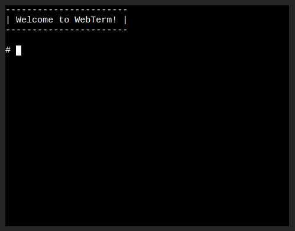

# WebTerm

WebTerm is a Terminal emulator that runs in the browser. It uses [v86](https://github.com/copy/v86) to create a virtual linux via WebAssembly and [xterm.js](https://github.com/xtermjs/xterm.js) as the terminal.

## Getting started
You can try out a hosted of WebTerm at https://webterm.onrender.com/ or clone the repo and serve the files with any webserver.

It takes about 20 seconds to a few minutes to download the ~45mb iso image and boot the system. 

You can copy and paste text with Ctrl+Alt+C and Ctrl+Alt+V because Ctrl+Shift+C is already used by the the debugger.

## How does it work?
WebTerm uses the [v86](https://github.com/copy/v86) library to boot up a minimal Linux iso via WebAssembly and then attaches an instance of [xterm.js](https://github.com/xtermjs/xterm.js) to the serial port (/dev/ttyS0).

## Customize the Linux ISO
The Linux system is built via Buildroot. If you want to customize the OS, look at [docs/buildroot.md](docs/buildroot.md)